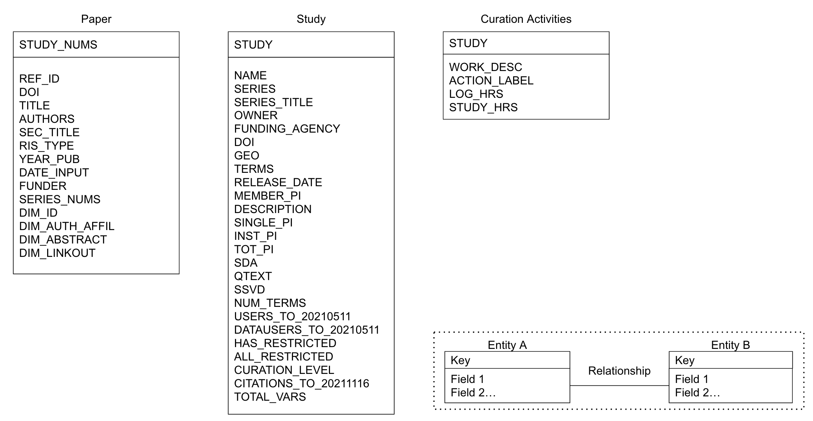

# Data Descriptor

This repository contains: 1) original datasets analyzed in MICA project published papers (`/data_original`), 2)  processing notebooks to prepare data for Level 1 curation at ICPSR (`/notebooks`), 3) and processed files for internal review (`/data_transform`) to publish as a replication dataset for a Nature Scientific Data article.

**Steps**
- [x] Pre-process and prepare tables by merging project admin data (`/notebooks/transform-data.ipynb`)
- [x] Request review by Data Stewardship Committee - discuss whether data can be shared as they are or will require additional transformation
- [ ] Pre-curate data in SPSS to expedite publication - document variables in a codebook, address missing values, add variable labels using definitions below
- [ ] Request Level 1 curation for deposit in ICPSR General Archive

**Sources**
- `/data_original`
    - `ICPSR_bib_studies_20211111.xlsx` (DBInfo: Study and Bibliography paper metadata; used in JASIST, ASIS&T, QSS analyses)
    - `ICPSR_combined_study_usage_20210430_onlyData_noAllREST.xlsx` (DBInfo: data file downloads per study; used in regression analysis studing curation level and data reuse for JASIST)
    - `jira_curation_level_20210426_by_study.csv` (DBInfo: study curation level; used in regression analysis studing curation level and data reuse for JASIST)
    - `predicted_curation_by_study.csv` (Jira: study level work log sentences - classified; used in eScience analysis of curation effort and activities)
    - `processing_history_commands_2019_20220502.csv`(Processing History: commands per study; used in RDAP analysis of data transformation and organizational change)
    - `variable_counts_by_study.csv` (DBInfo: study variables by data files; used in regression analysis studing curation level and data reuse for JASIST)
- `/data_transform`
    - `ICPSR_CURATION_LOGS.csv` (each row is one activity classified from a Jira study-level curation work log)
    - `ICPSR_PAPERS.csv` (each row is one publication in the ICPSR Bibliography that cites one or more studies)
    - `ICPSR_PROCESSING_HISTORY.csv` (each row is one study and its processing history commands in SPSS syntax)
    - `ICPSR_STUDIES.csv` (each row is one study in the ICPSR catalog and its usage information until pull date)

**Outputs**
- Bleckley, D., Lafia, S., and Hemphill, L. (2023) Describing Data Transformation Work in a Changing Data Curation Community. Research Data Access and Preservation (RDAP) Summit. Online. March 28.
- Lafia, S., Fan, L., Thomer, A., & Hemphill, L. (2022). Subdivisions and Crossroads: Identifying Hidden Community Structures in a Data Archive’s Citation Network. Quantitative Science Studies (QSS), 3(3), 694-714. doi: [10.1162/qss_a_00209](https://doi.org/10.1162/qss_a_00209)
- Lafia, S., Fan, L., and Hemphill, L. (2022). A Natural Language Processing Pipeline for Detecting Informal Data References in Academic Literature. Proceedings of the Association for Information Science and Technology (ASIS&T), 59(1), 169-178. doi:[10.1002/pra2.614](https://doi.org/10.1002/pra2.614)
- Hemphill, L., Pienta, A., Lafia, S., Akmon, D., & Bleckley, D. (2022). How do properties of data, their curation, and their funding relate to reuse?. Journal of the Association for Information Science and Technology (JASIST), 73(10), 1432-1444. doi:[10.1002/asi.24646](https://doi.org/10.1002/asi.24646)
- Lafia, S., Thomer, A., Bleckley, D., Akmon, D., & Hemphill, L. (2021). Leveraging Machine Learning to Detect Data Curation Activities. In 2021 IEEE 17th International Conference on eScience (eScience) (pp. 149-158). IEEE. doi:[10.1109/eScience51609.2021.00025](https://doi.org/10.1109/eScience51609.2021.00025)

**Entity-Relation Diagram**

[Link](https://docs.google.com/drawings/d/1gY4DGJp4shW6q7cev1G2my1bHf6nKEpoBrKCoPi8UT4/edit?usp=sharing)

**Variables**
- `/data_transform/ICPSR_CURATION_LOGS.csv`
    - STUDY = ICPSR study number
    - WORK_DESC = ICPSR curator work log entry sentence from Jira ticket
    - ACTION_LABEL = label assigned to work log text ('Metadata-study-level', 'Quality-checks', 'Non-curation', 'Initial-review-and-planning', 'Communication-for-study', 'Transformation-of-data', 'Documentation', 'Other')
    - LOG_HRS = fraction of study work time associated with action label
    - STUDY_HRS = total study work time logged in ticket
- `/data_transform/ICPSR_PAPERS.csv` (Date papers added: 2000-08-11 to 2021-11-16; Dimensions: 2021-11-09)
    - REF_ID = ICPSR paper number
    - DOI = paper digital object identifier
    - TITLE = official paper title
    - AUTHORS = researchers who authored paper
    - SEC_TITLE = name of publication outlet
    - RIS_TYPE = type of publication ('NEWS', 'JOUR', 'RPRT', 'MGZN', 'ADVS', 'BOOK', 'CHAP', 'CONF', 'ELEC', 'GEN', 'THES')
    - FUNDER = organization names that supported data production and/or archiving 
    - YEAR_PUB = year paper added to ICPSR Bibliography
    - DATE_INPUT = year paper was first published
    - SERIES_NUMS = ICPSR series number of studies used in paper
    - STUDY_NUMS = ICPSR study numbers used in paper
    - DIM_ID = Dimensions database identifier
    - DIM_AUTH_AFFIL = Dimensions database author affiliations
    - DIM_ABSTRACT = Dimensions database paper abstract
    - DIM_LINKOUT = Dimensions database URL link to full text
<!--`/data_transform/ICPSR_PROCESSING_HISTORY.csv`-->
<!--    - STUDY = ICPSR study number - TOTAL_LINES = total lines of code in processing history syntax file-->
<!--    - COMMENTS = total count of comments in processing history syntax file-->
<!--    - ... = remaining columns contain [SPSS commands](https://www.spss-tutorials.com/overview-all-spss-commands/) (procedures, transformations, other) where each column count of one command per file-->
- `/data_transform/ICPSR_STUDIES.csv` (Date studies released: 1984-03-18 to 2021-11-16)
    - STUDY = ICPSR study number
    - DOI = ICPSR study digital object identifier
    - NAME = official ICPSR study name
    - SERIES = ICPSR series number
    - SERIES_TITLE = official ICPSR series title
    - PRINCIPAL_INV = authoring entities for the study
    - DESCRIPTION = text abstract of the study's subject matter or intellectual content
    - RELEASE_DATE = m/dd/yyyy date when the data collection was first distributed by ICPSR
    - FUNDING_AGENCY = organizations that supported production and/or archiving of the data
    - GEO = ICPSR defined geographic areas covered in data collection
    - TERMS = ICPSR controlled subject terms covered in data collection
    - OWNER = archive owner for the data ('ICPSR', 'NACJD', 'DSDR', 'RCMD', 'NAHDAP', 'NACDA', 'NADAC', 'HMCA', 'CFDA', 'civicleads', 'AERA', 'METLDB', 'APA', 'UCC', 'ADDEP', 'odf', 'gmsdata', 'pcoridata', 'pcodr', 'DAIRL', 'appfed')
    - CURATION_LEVEL = level specifying the set of curation activities to be performed on a given dataset ('Fast Release', 'Level 0', 'Level 1', 'Level 2', 'Level 3', 'Other')
    - SINGLE_PI = study has one PI entity (0=no, 1=yes)
    - INST_PI = study has one or more institutional PIs (0=no, 1=yes)
    - TOT_PI = total count of PIs for a study
    - TOTAL_VARS = count of variables for all data files per study
    - SDA = study data made available for online analysis (0=no, 1=yes)
    - QTEXT = study question text from surveys made searchable (0=no, 1=yes)
    - SSVD = study variables indexed in social science variable database (0=no, 1=yes)
    - HAS_RESTRICTED = study contains one or more restricted files (0=no, 1=yes)
    - ALL_RESTRICTED = full study is restricted and no download information is available (0=no, 1=yes)
    - USERS_TO_20210511 = count of unique users downloading study data files, codebooks, or other to 2021
    - DATAUSERS_TO_20210511 = count of unique users downloading study data files only to 2021
    - CITATIONS_TO_20211116 = count of unique papers citing study to 2021
    
**Usage Notes**
* Study release date (earliest: 1984) is inaccurate
* Publication dates (missing or < 1963) recoded to 0
* Missing study description text ("nan") replaced with empty string ("")
* Worklogs are split on new line (many to one per Jira ticket) and classified
* This dataset contains data from different pulls, so some variables are null for most studies (e.g., SINGLE_PI, INST_PI)
* There are studies with negative numbers for TOTAL_VARS, likely from missing value designations (need to document)